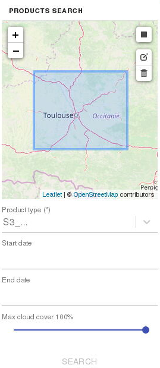
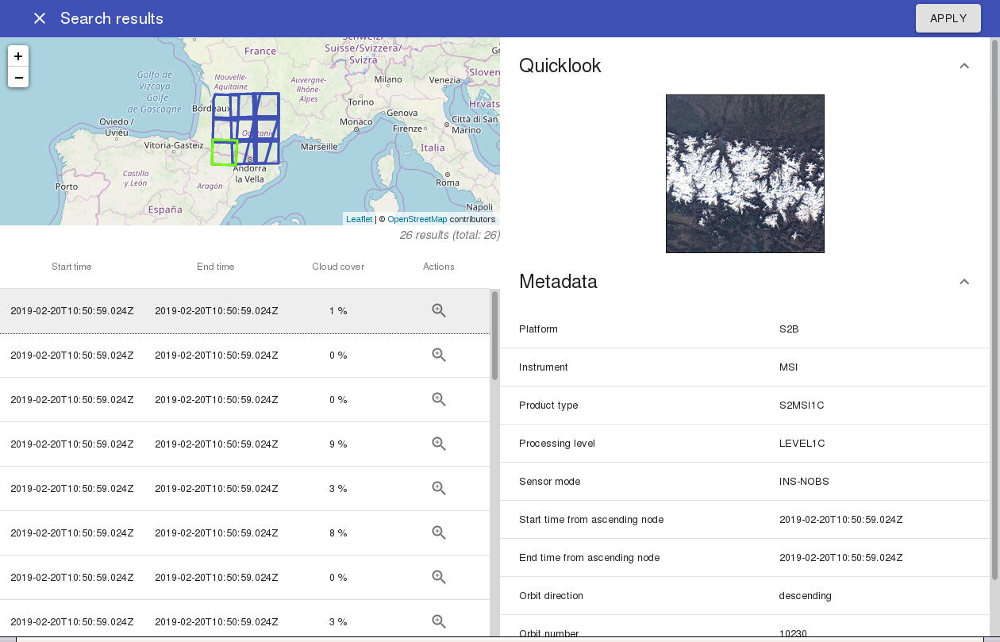

# eodag-labextension - Manuel d'utilisation

Le plugin de recherche eodag-labextension permet de réaliser une recherche de produits satellites, d'examiner le résultat et si ce résultat est conforme au besoin, de générer dans un notebook le code Python permettant d'accéder aux mêmes produits via la librairie Python eodag.

## Recherche


Activer l'onglet du plugin grâce à l'icone correspondante.



Le formulaire permet la saisie de l'emprise de recherche et des critères suivants :

* Product type : le type de produit recherché. Pour chaque produit dans la liste déroulante, un tooltip descriptif s'affiche au survol.
* Start date : la date minimale de la fenêtre de recherche temporelle des produits.
* End date : la date maximale de la fenêtre de recherche temporelle des produits.
* Max cloud cover : le taux de couverture nuageuse maximum accepté dans les résultats de recherche en pourcentage.

L'emprise et le product type sont des critères obligatoires. Les autres sont optionnels.

Une fois les critères de recherche renseignés, cliquer sur le bouton "search", lancera la recherche. A l'issue de cette recherche, une popup s'ouvre et affiche les résultats de recherche.

## Affichage des résultats



La popup d'affichage des résultats de recherche est composée de 3 parties :

* la carte affichant les emprises des produits,
* le tableau listant les produits,
* l'affichage des métadonnées des produits.

Le tableau des résultats permet d'accéder aux métadonnées des produits par un clic sur la ligne du produit souhaité. Le bouton loupe permet de zoomer sur l'emprise du produit dans la vue cartographique. En descendant dans la liste des résultats, la recherche est automatiquement relancée pour rapatrier les résultats suivants.

Dans la vue des métadonnées, un clic sur l'imagette permet de l'afficher en résolution native. Un nouveau clic permet de réduire à nouveau sa taille.

## Application au notebook Jupyter

Si le résultat de la recherche est satisfaisant, cliquer sur le bouton "Apply" permet d'insérer le code Python eodag dans une nouvelle cellule du notebook actuellement ouvert. La popup est automatiquement fermée. A partir de là, il est possible de travailler dans le notebook sur les résultats de recherche en exécutant la recherche eodag.

Voici un exemple de code généré dans le notebook :

```python
from eodag import EODataAccessGateway
dag = EODataAccessGateway()
product_type = 'S2_MSI_L1C'
footprint = {'lonmin': 0.660957, 'latmin': 43.149093, 'lonmax': 2.388008, 'latmax': 44.190082}
cloud_cover = 15
start, end = '2019-02-01', '2019-02-15'
search_results, estimated_total_nbr_of_results = dag.search(
    productType=product_type,
    box=footprint,
    start=start,
    end=end,
    cloudCover=cloud_cover,
)
```

Le fichier de configuration d'eodag doit-être placé dans `$HOME/.config/eodag/eodag.yml` (voir [la documentation d'eodag](https://eodag.readthedocs.io/en/latest/intro.html#how-to-configure-authentication-for-available-providers)).

## Utilisation des résultats

Voici des exemples d'utilisation des résultats de recherche dans le notebook :

```python
from pprint import pprint

# Affichage de la liste des résultats
pprint(search_results)

# Affichage des chemins d'accès des produits
pprint([p.location for p in search_results])

# Téléchargement d'un produit
search_results[0].download()
```

Consulter la page https://eodag.readthedocs.io/en/latest/ pour plus d'informations sur l'utilisation de la librairie eodag.
